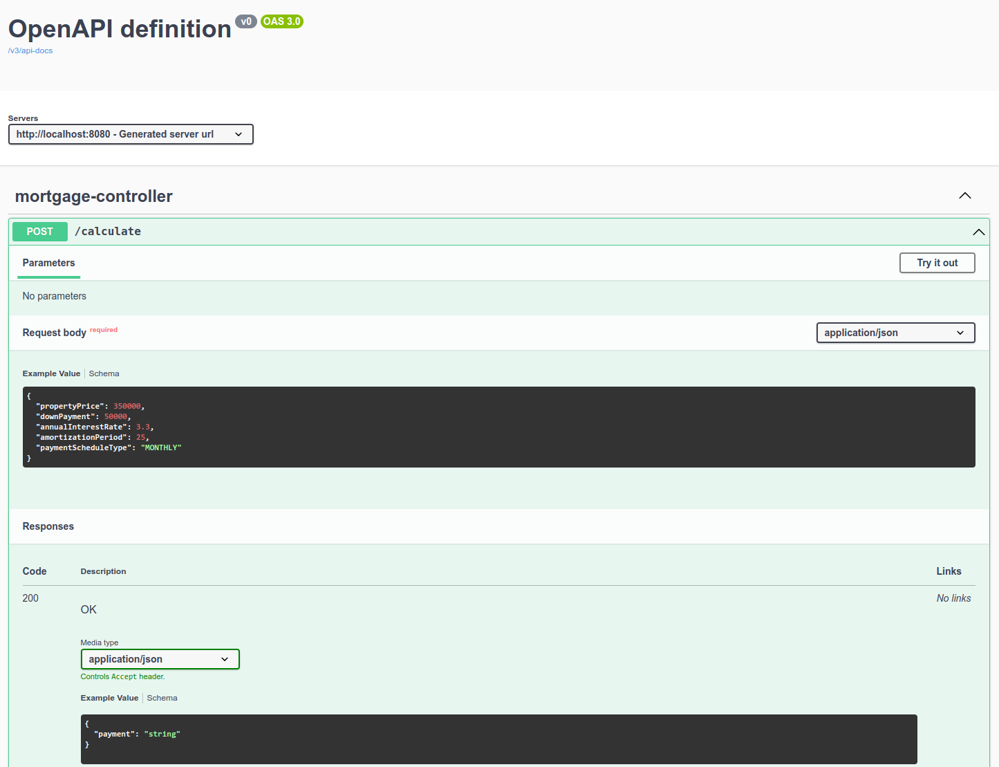
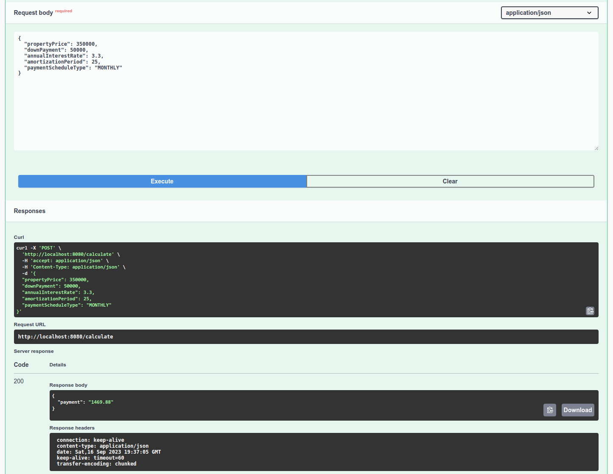
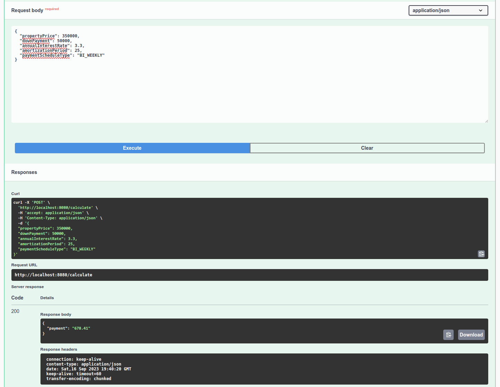
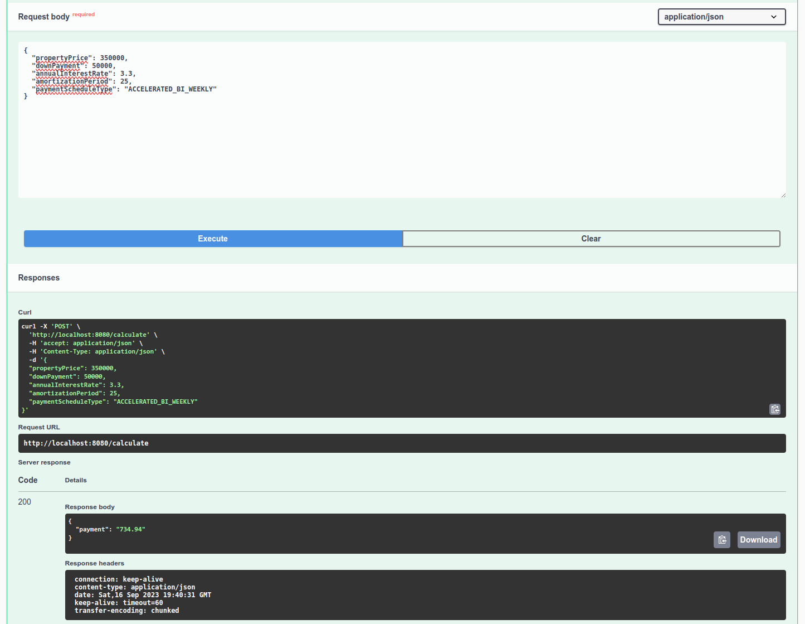
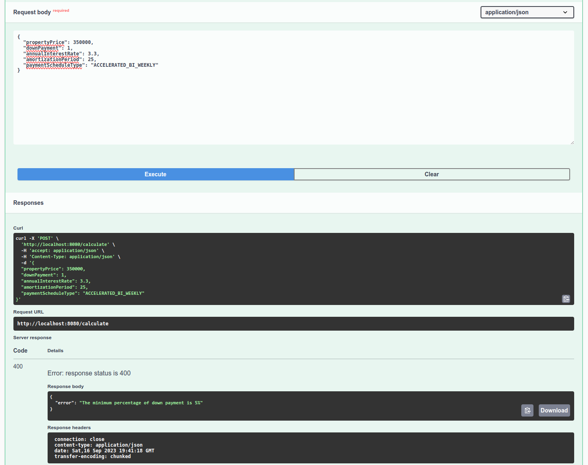
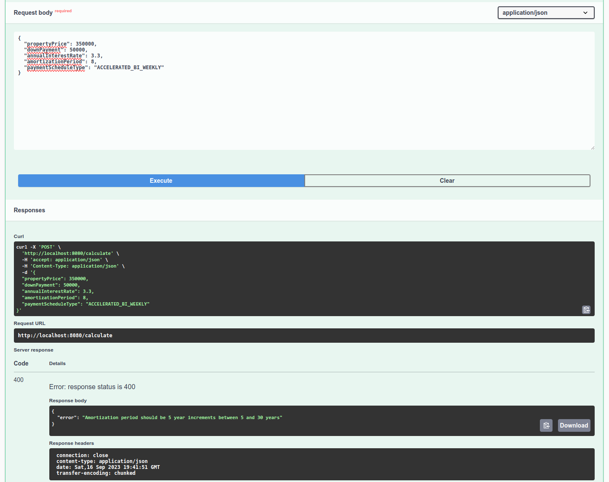

# Prerequisites
- Java 17 
- Maven

# Unit Tests
`mvn test`

# Start
`mvn spring-boot:run`

# API
The service will be deployed at port `8080`

The endpoint: `POST /calculate`

# Info
I used information from [this website](https://www.ratehub.ca/mortgage-payment-options) to understand how to calculate bi-weekly and accelerated bi-weekly payments.

# UI
Please use Swagger to test API

http://localhost:8080/swagger-ui/index.html

Examples

## Happy Path
### Monthly

### Bi-weekly

### Accelerated Bi-weekly

## Examples of Exceptions
### Property price is 0

### Down payment is too small

### Annual interest rate is negative

### Amortization period is wrong

### Payment schedule yype is NULL

